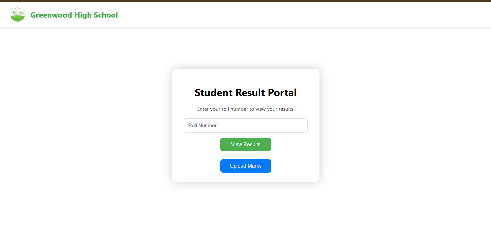
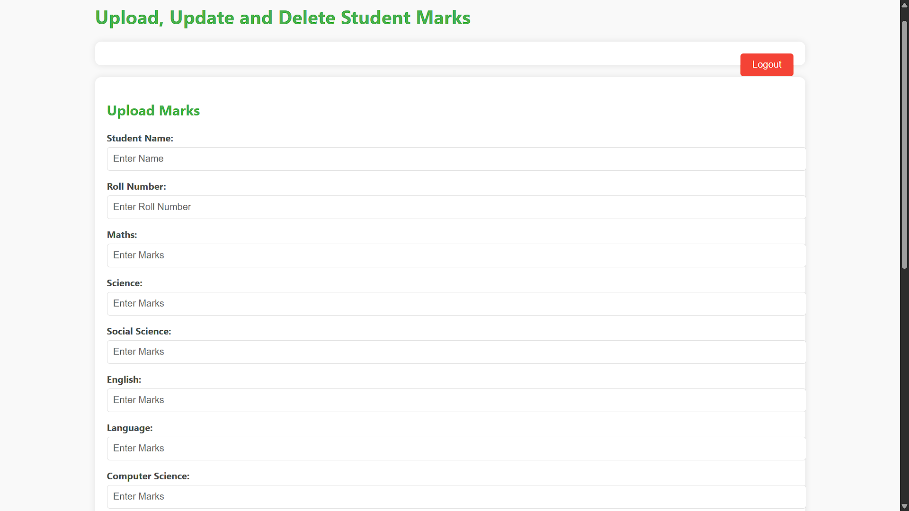
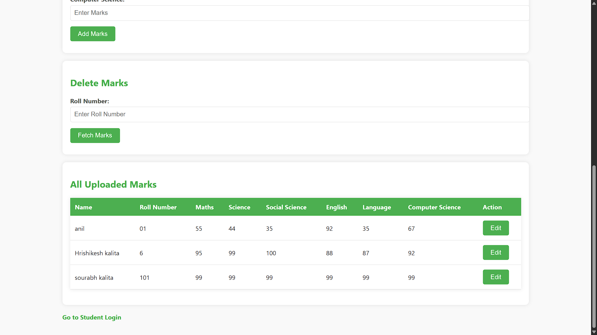
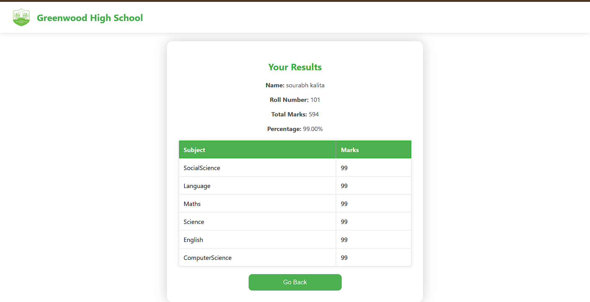
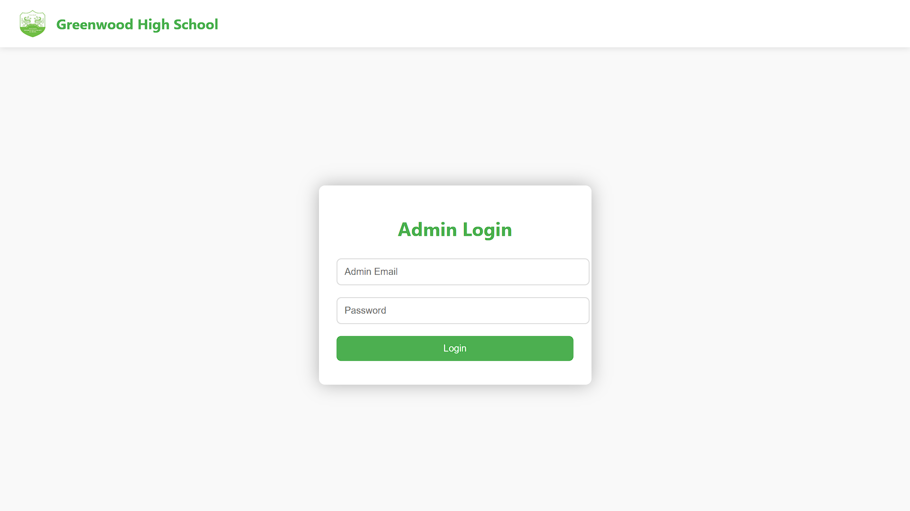

# 🎓 Student Result Portal

A web-based Student Result Portal and independent practice project built with Firebase Authentication and Cloud Firestore, demonstrating secure result management, CRUD operations, authentication, and responsive frontend development.

🔗 **Live Demo:** https://student-result-zeta.vercel.app/

---

## 📷 Preview

### Student Portal Home Page



### Admin Dashboard



### Student Records Management



---

## 📌 Overview

Student Result Portal is a web application that allows students to securely view their academic results using their roll number while providing administrators with a protected dashboard to upload, update, edit, and manage student marks.

This project was developed as an **independent practice project** to gain hands-on experience with:

* Firebase Authentication
* Cloud Firestore Database
* CRUD Operations
* JavaScript DOM Manipulation
* Authentication & Authorization
* Responsive Web Design
* Deployment using Vercel

---

## ✨ Features

### 👨‍🎓 Student Features

* Search results using Roll Number
* View student details
* Display subject-wise marks
* Automatic total marks calculation
* Automatic percentage calculation
* Responsive user interface
* Fast Firestore-based result retrieval

### 👨‍🏫 Admin Features

* Secure Firebase Authentication Login
* Upload student marks
* Update existing student records
* Edit marks directly from dashboard
* Delete individual subject marks
* View all uploaded records
* Logout functionality
* Protected admin-only access

---

## 🛠️ Tech Stack

### Frontend

* HTML5
* CSS3
* JavaScript (Vanilla JS)

### Backend & Database

* Firebase Authentication
* Cloud Firestore

### Deployment

* Vercel

---

## 🧠 Skills Demonstrated

This project demonstrates practical experience with:

* HTML5
* CSS3
* JavaScript
* Firebase Authentication
* Cloud Firestore
* CRUD Operations
* Form Validation
* DOM Manipulation
* Authentication & Authorization
* Session Management
* Database Querying
* Responsive UI Design
* Error Handling
* Vercel Deployment

---

## 📂 Project Structure

```text
student-result/
│
├── screenshots/
│   ├── student-home.png
│   ├── student-result.png
│   ├── admin-login.png
│   ├── admin-dashboard.png
│   └── admin-dashboard2.png
│
├── index.html
├── admin-login.html
├── upload.html
├── fhss_logo-removebg-preview.png
└── README.md
```

---

## 🔥 Firebase Services Used

### Firebase Authentication

Used for:

* Admin Login
* Session Management
* Authentication State Monitoring
* Logout Functionality
* Route Protection

### Cloud Firestore

Used for:

* Storing student records
* Managing marks
* Retrieving results
* Updating records
* Deleting marks
* Real-time data storage

---

## 🗄️ Database Structure

### Collection: `students`

Example Document:

```json
{
  "name": "Sourabh Kalita",
  "rollNumber": "101",
  "marks": {
    "Maths": 95,
    "Science": 92,
    "SocialScience": 90,
    "English": 96,
    "Language": 94,
    "ComputerScience": 98
  },
  "lastUpdated": "timestamp"
}
```

---

## 🔄 Application Workflow

### Student Workflow

1. Open the Student Result Portal.
2. Enter Roll Number.
3. Firestore searches for matching student records.
4. Student details and marks are displayed.
5. Total marks and percentage are calculated automatically.

### Admin Workflow

1. Click **Upload Marks**.
2. Login using Firebase Authentication.
3. Access the Admin Dashboard.
4. Add, edit, update, or delete marks.
5. Firestore updates data instantly.
6. Logout securely when finished.

---

## 📸 Screenshots

### Student Home Page


---

### Student Results Page



---

### Admin Login Page



---

### Admin Dashboard - Upload & Manage Records


---

### Admin Dashboard - Student Records Table


---

## 🚀 Installation

### Clone the Repository

```bash
git clone https://github.com/Sourabh-droid/student-result.git
```

### Navigate to the Project Folder

```bash
cd student-result
```

### Configure Firebase

Replace the Firebase configuration with your own credentials:

```javascript
const firebaseConfig = {
  apiKey: "YOUR_API_KEY",
  authDomain: "YOUR_PROJECT.firebaseapp.com",
  projectId: "YOUR_PROJECT_ID",
  storageBucket: "YOUR_PROJECT.appspot.com",
  messagingSenderId: "YOUR_SENDER_ID",
  appId: "YOUR_APP_ID"
};
```

### Run the Application

Open `index.html` directly in your browser or run a local development server:

```bash
python -m http.server 8000
```

Then visit:

```text
http://localhost:8000
```

---

## 🔒 Security Features

* Firebase Authentication
* Protected Admin Dashboard
* Authentication State Monitoring
* Session Persistence
* Firestore Data Validation
* Client-side Input Validation

---

## 🎯 Learning Objectives

This project was built to practice and strengthen skills in:

* Firebase Authentication
* Firestore Database Integration
* CRUD Operations
* Responsive Frontend Development
* JavaScript Programming
* User Authentication Flows
* Database Design
* Web Application Deployment

---

## 🔮 Future Improvements

Potential enhancements include:

* Role-Based Access Control
* Password Reset Functionality
* Student Login Accounts
* PDF Result Export
* Result Printing Feature
* Search and Filter Records
* Grade Classification System
* Dashboard Analytics
* Multi-School Support
* Dark Mode

---

## 👨‍💻 Developer

**Sourabh Kalita**

GitHub: https://github.com/Sourabh-droid

---

## 🌐 Live Demo

https://student-result-zeta.vercel.app/

---

## 📄 License

© 2025 Sourabh Kalita. All Rights Reserved.

This project is provided for portfolio, demonstration, and educational purposes.

The source code may not be copied, modified, redistributed, or used commercially without explicit permission from the author.
